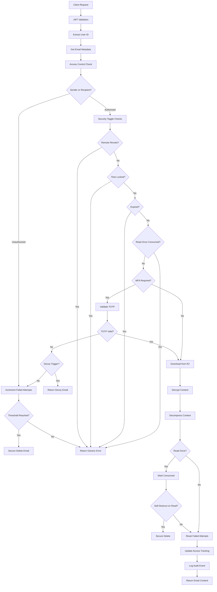
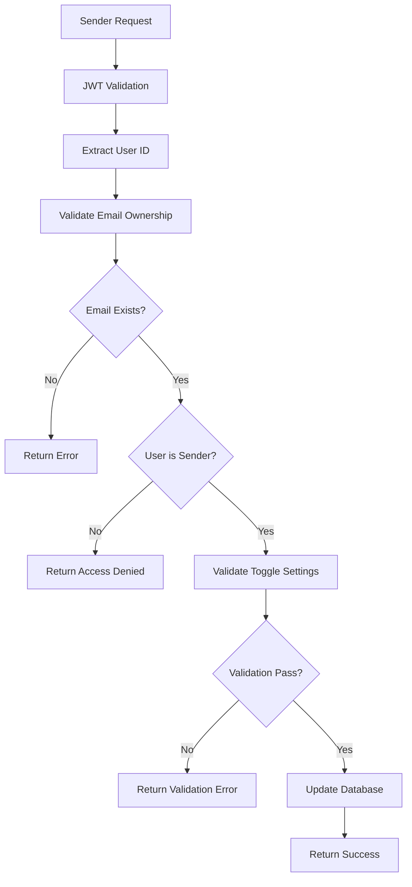
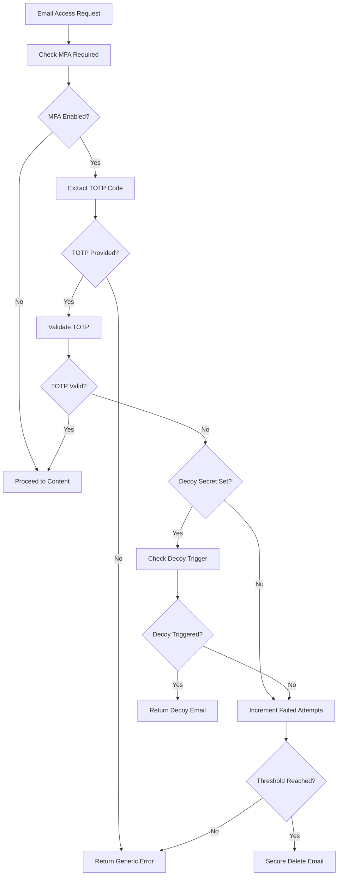

# Secure Email MVP Backend - Comprehensive Documentation

## Table of Contents
1. [System Overview](#system-overview)
2. [Architecture](#architecture)
3. [Security Features](#security-features)
4. [API Endpoints](#api-endpoints)
5. [Database Schema](#database-schema)
6. [Workflows](#workflows)
7. [Testing Strategy](#testing-strategy)
8. [Deployment](#deployment)
9. [Troubleshooting](#troubleshooting)

## System Overview

The Secure Email MVP is a high-security email system built with Go 1.23, featuring end-to-end encryption, per-email security toggles, and comprehensive audit logging. The system uses SQLite for metadata storage and Cloudflare R2 for encrypted blob storage.

### Key Components
- **Backend API**: Go-based REST API with JWT authentication
- **Database**: SQLite for user data, email metadata, and audit logs
- **Storage**: Cloudflare R2 for encrypted email content
- **Security**: AES-256-GCM encryption, Argon2id hashing, TOTP MFA
- **Monitoring**: Comprehensive audit logging and suspicious activity detection

## Architecture

### Directory Structure
```
secure-email-mvp/
├── cmd/api/                    # Main API server
│   ├── main.go                 # Server entry point and route registration
│   ├── get_email_by_id_handler.go  # Core email retrieval with security
│   ├── get_email_by_id_handler_test.go  # Integration tests
│   └── ...                     # Other handlers
├── pkg/
│   ├── auth/                   # Authentication and encryption
│   ├── email/                  # Email security and database operations
│   │   ├── database.go         # EmailSecurityDB operations
│   │   └── types.go            # Security toggle structures
│   ├── storage/                # R2 storage operations
│   └── ...                     # Other packages
├── schema/                     # Database migrations
└── .env                        # Environment configuration
```

### Core Components

#### 1. Server (`cmd/api/main.go`)
The main server orchestrates all components:
- **Database Connection**: SQLite with comprehensive migrations
- **R2 Storage**: Cloudflare R2 for encrypted blob storage
- **Middleware**: JWT authentication, CORS, security headers
- **Rate Limiting**: Per-IP rate limiting for authentication endpoints
- **Services**: Notification, audit, read receipts, suspicious detection

#### 2. Email Security Database (`pkg/email/database.go`)
Handles all email security operations:
- **Security Toggles**: Per-email security settings management
- **Access Control**: Time locks, expiration, remote revoke
- **Self-Destruct**: Failed attempts counter with secure deletion
- **Read-Once**: Burn-after-read functionality with atomic operations
- **R2 Integration**: Physical deletion of encrypted blobs

#### 3. Email Retrieval Handler (`cmd/api/get_email_by_id_handler.go`)
The core email retrieval endpoint with comprehensive security:
- **Authentication**: JWT validation and user authorization
- **Security Enforcement**: All per-email security toggles
- **MFA Integration**: TOTP verification for protected emails
- **Decoy Messages**: Plausible deniability for invalid access
- **Audit Logging**: Comprehensive access event tracking

## Security Features

### 1. Per-Email Security Toggles (`pkg/email/types.go`)

Each email can have individualized security settings:

```go
type EmailSecurityToggles struct {
    NotBefore              *int64  // Time lock: access denied before timestamp
    ExpiresAt              *int64  // Expiration: access denied after timestamp
    ReadOnce               bool    // Burn after first access
    MFAOnOpen              bool    // Require TOTP for access
    DecoySecret            *string // Argon2id hash for decoy messages
    RemoteRevoke           bool    // Sender can revoke access anytime
    StripMetadata          bool    // Remove EXIF data from attachments
    SelfDestructThreshold  *int    // Max failed attempts before deletion
    GeoRulesRef            *string // JSON reference to geofencing rules
    SelfDestructOnReadOnce bool    // Delete after first read
}
```

### 2. Authentication & Authorization

#### JWT Authentication
- **Token Validation**: Bearer token validation in `jwtMiddleware`
- **User Context**: User ID injected into request context
- **Session Management**: Access and refresh token system

#### Access Control
- **Sender Authorization**: Only sender can update security settings
- **Recipient Authorization**: Recipients can only read emails sent to them
- **Generic Errors**: Prevents information leakage through error messages

### 3. Encryption & Security

#### Email Content Encryption
- **AES-256-GCM**: Symmetric encryption for email content
- **Gzip Compression**: Reduces storage and bandwidth usage
- **Integrity Verification**: Auth tag verification for content integrity
- **Key Management**: Per-email encryption keys stored encrypted

#### Password Security
- **Argon2id Hashing**: For passwords and decoy secrets
- **Salt Generation**: Email ID used as salt for decoy secrets
- **Brute Force Protection**: Per-email and per-IP rate limiting

### 4. Multi-Factor Authentication

#### TOTP Integration
- **Time-based OTP**: Using `github.com/pquerna/otp/totp`
- **Per-Email MFA**: Separate from account MFA
- **Device Tracking**: Consumer device tracking for read-once emails

#### MFA Enforcement Flow
1. Check `mfa_on_open` flag
2. Extract TOTP from query params or Authorization header
3. Validate TOTP against stored secret
4. Check decoy trigger if TOTP invalid
5. Increment failed attempts on failure

### 5. Self-Destruct & Read-Once

#### Self-Destruct Counter
- **Failed Attempts**: Incremented on unauthorized access
- **Configurable Threshold**: Per-email setting (default: 3)
- **Secure Deletion**: Both database and R2 blob deletion
- **Atomic Operations**: Transaction-based for consistency

#### Read-Once Implementation
- **Atomic Marking**: Optimistic locking prevents race conditions
- **Consumption Tracking**: Timestamp and device tracking
- **Optional Deletion**: Can delete after consumption
- **Generic Errors**: Prevents information leakage

### 6. Decoy Messages

#### Plausible Deniability
- **Decoy Secret**: Argon2id hash of decoy password/TOTP
- **Trigger Conditions**: Invalid TOTP, unauthorized access
- **Consistent Structure**: Same response format as real emails
- **No Information Leakage**: Doesn't reveal email existence

## API Endpoints

### Core Email Endpoints

#### `GET /api/email/{id}` - Secure Email Retrieval
**Purpose**: Retrieve and decrypt email content with full security enforcement

**Security Flow**:
1. **Authentication**: JWT token validation
2. **Access Control**: Verify user is sender or recipient
3. **Security Checks**: Remote revoke, time lock, expiration
4. **Read-Once Check**: Verify email hasn't been consumed
5. **MFA Verification**: TOTP validation if required
6. **Decoy Trigger**: Return decoy if invalid access
7. **Content Retrieval**: Download from R2, decrypt, decompress
8. **Consumption**: Mark read-once if applicable
9. **Cleanup**: Reset failed attempts, update access tracking
10. **Audit**: Log access event with metadata

**Response Structure**:
```json
{
  "id": "email-id",
  "sender": "sender@example.com",
  "recipient": "recipient@example.com",
  "subject": "Decrypted subject",
  "body": "Decrypted content",
  "sent_at": "2024-01-01T00:00:00Z",
  "security_toggles": {
    "read_once": true,
    "mfa_on_open": true,
    "self_destruct_threshold": 3
  },
  "status": "success"
}
```

#### `POST /api/email/security/{id}` - Update Security Settings
**Purpose**: Update per-email security toggles (sender only)

#### `GET /api/email/security/{id}` - Get Security Settings
**Purpose**: Retrieve current security settings (sender only)

### Authentication Endpoints

#### `POST /api/auth/login` - User Authentication
- Password + TOTP authentication
- JWT token generation
- Rate limiting protection

#### `POST /api/auth/signup` - User Registration
- Email validation
- Password hashing with Argon2id
- Rate limiting protection

### MFA Endpoints

#### `POST /api/mfa/validate` - MFA Validation
- TOTP code validation
- Email-based MFA support

## Database Schema

### Core Tables

#### `users` Table
```sql
CREATE TABLE users (
    id INTEGER PRIMARY KEY,
    email TEXT UNIQUE NOT NULL,
    password_hash TEXT NOT NULL,
    created_at INTEGER NOT NULL DEFAULT (strftime('%s', 'now')),
    totp_secret TEXT,
    totp_enabled BOOLEAN DEFAULT FALSE
);
```

#### `emails` Table
```sql
CREATE TABLE emails (
    email_id TEXT PRIMARY KEY,
    sender_id INTEGER NOT NULL,
    recipient TEXT NOT NULL,
    subject TEXT NOT NULL,
    encrypted_blob_url TEXT NOT NULL,
    encrypted_key TEXT NOT NULL,
    encryption_nonce TEXT NOT NULL,
    encryption_auth_tag TEXT NOT NULL,
    compression_algo TEXT NOT NULL DEFAULT 'gzip',
    created_at INTEGER NOT NULL,
    
    -- Security Toggles
    not_before INTEGER,
    expires_at INTEGER,
    read_once BOOLEAN DEFAULT FALSE,
    mfa_on_open BOOLEAN DEFAULT FALSE,
    decoy_secret TEXT,
    totp_secret TEXT,
    remote_revoke BOOLEAN DEFAULT FALSE,
    strip_metadata BOOLEAN DEFAULT FALSE,
    self_destruct_threshold INTEGER DEFAULT 3,
    geo_rules_ref TEXT,
    self_destruct_on_read_once BOOLEAN DEFAULT FALSE,
    
    -- Access Tracking
    failed_attempts INTEGER DEFAULT 0,
    read_once_consumed_at INTEGER,
    read_once_consumer_device TEXT,
    last_access_at INTEGER,
    access_count INTEGER DEFAULT 0,
    
    FOREIGN KEY (sender_id) REFERENCES users(id)
);
```

#### `audit_log` Table
```sql
CREATE TABLE audit_log (
    log_id TEXT PRIMARY KEY,
    timestamp INTEGER NOT NULL,
    event_type TEXT NOT NULL,
    user_id TEXT,
    ip_address TEXT,
    user_agent TEXT,
    related_email_id TEXT,
    outcome TEXT NOT NULL,
    details TEXT,
    severity TEXT DEFAULT 'info',
    country TEXT,
    city TEXT
);
```

## Workflows

### 1. Email Retrieval Workflow



### 2. Security Toggle Update Workflow



### 3. MFA Enforcement Workflow



## Testing Strategy

### Test Categories

#### 1. Unit Tests
- **Helper Functions**: TOTP validation, decoy trigger checking
- **Database Operations**: Security toggle CRUD operations
- **Encryption**: AES-256-GCM encryption/decryption
- **Validation**: Security toggle validation rules

#### 2. Integration Tests
- **HTTP Endpoints**: Full request/response testing
- **Database Integration**: Real database operations
- **R2 Integration**: Cloud storage operations
- **Security Enforcement**: Complete security flow testing

#### 3. Security Tests
- **Access Control**: Unauthorized access attempts
- **Self-Destruct**: Failed attempts threshold testing
- **Read-Once**: Consumption and re-access testing
- **MFA**: TOTP validation and failure scenarios
- **Decoy Messages**: Plausible deniability testing

### Test Environment Setup

#### R2 Integration Tests
```go
// Conditional R2 testing based on environment variables
if os.Getenv("R2_ACCESS_KEY_ID") == "" {
    t.Skip("Skipping test - R2 credentials not available")
}

// Test cleanup
t.Cleanup(func() {
    r2Client.DeleteEmail(ctx, emailID)
})
```

#### Database Setup
```go
// In-memory SQLite for testing
db, err := sql.Open("sqlite", ":memory:")
if err != nil {
    t.Fatalf("Failed to open test database: %v", err)
}
defer db.Close()

// Run migrations
if err := runMigrations(db); err != nil {
    t.Fatalf("Failed to run migrations: %v", err)
}
```

## Deployment

### Environment Configuration

#### Required Environment Variables
```bash
# Database
SQLITE_DB=/var/db/secure-email.db

# JWT Authentication
JWT_SECRET=your-secret-key

# Cloudflare R2 Storage
R2_ACCESS_KEY_ID=your-access-key
R2_SECRET_ACCESS_KEY=your-secret-key
R2_BUCKET=your-bucket-name
R2_ENDPOINT=https://your-account-id.r2.cloudflarestorage.com
R2_REGION=auto

# Email Cleanup
EMAIL_CLEANUP_INTERVAL_MINUTES=15

# Logging
LOG_FILE=/var/log/api.log
```

#### Optional Environment Variables
```bash
# Test Mode
SIMULATE_SELF_DESTRUCT=1

# Rate Limiting
RATE_LIMIT_REQUESTS=5
RATE_LIMIT_WINDOW_MINUTES=1
```

### Database Migrations

The system applies migrations in order:
1. Core schema (users, emails)
2. Security features (failed attempts, MFA, read-once)
3. Audit and monitoring (audit logs, suspicious detection)
4. Advanced features (geolocation, notifications)

### Health Checks

#### `/ping` Endpoint
- Simple liveness probe
- Returns "pong" for basic connectivity

#### `/health` Endpoint
- JSON status response
- Database connectivity check
- R2 connectivity check

## Troubleshooting

### Common Issues

#### 1. Database Connection Errors
```bash
# Check database file permissions
ls -la /var/db/secure-email.db

# Check database directory exists
mkdir -p /var/db

# Verify SQLite driver
go mod tidy
```

#### 2. R2 Storage Errors
```bash
# Verify R2 credentials
echo $R2_ACCESS_KEY_ID
echo $R2_SECRET_ACCESS_KEY

# Test R2 connectivity
curl -X GET "https://your-account-id.r2.cloudflarestorage.com/your-bucket"

# Check bucket permissions
aws s3 ls s3://your-bucket --endpoint-url https://your-account-id.r2.cloudflarestorage.com
```

#### 3. JWT Authentication Issues
```bash
# Verify JWT secret is set
echo $JWT_SECRET

# Check token format
# Should be: Bearer <token>
```

#### 4. Test Failures
```bash
# Run specific test
go test -v -run TestGetEmailByIdHandler_Success

# Run with environment variables
JWT_SECRET=test-secret go test -v ./cmd/api/

# Skip R2 tests
go test -v ./cmd/api/ -tags=!integration
```

### Debugging

#### Enable Debug Logging
```go
// Add to main.go for detailed logging
log.SetFlags(log.LstdFlags | log.Lshortfile)
```

#### Database Debugging
```sql
-- Check email security settings
SELECT email_id, read_once, mfa_on_open, failed_attempts, read_once_consumed_at 
FROM emails WHERE email_id = 'your-email-id';

-- Check audit logs
SELECT * FROM audit_log WHERE related_email_id = 'your-email-id' ORDER BY timestamp DESC LIMIT 10;
```

#### R2 Debugging
```go
// Add R2 debugging to handlers
log.Printf("R2 Error Details - Blob ID: %s, Error Type: %T", blobID, r2Err)
```

### Performance Monitoring

#### Key Metrics
- **Response Times**: Email retrieval latency
- **Error Rates**: Failed authentication, access denied
- **Storage Usage**: R2 bucket size and object count
- **Database Performance**: Query execution times

#### Monitoring Endpoints
- `/health` - System health status
- `/admin/email-retention-stats` - Email statistics
- `/api/audit/logs` - Access audit logs

## Future Enhancements

### Planned Features
1. **Geofencing Enforcement**: Implement geo-restriction rules
2. **Advanced MFA**: Email-based MFA codes
3. **Enhanced Decoy**: More sophisticated decoy message generation
4. **Performance Optimization**: Connection pooling, caching
5. **Monitoring Dashboard**: Real-time system metrics

### Security Improvements
1. **Zero-Knowledge Proofs**: Advanced cryptographic proofs
2. **Hardware Security**: TPM integration for key storage
3. **Quantum Resistance**: Post-quantum cryptography preparation
4. **Advanced Threat Detection**: Machine learning-based anomaly detection

---

This documentation provides a comprehensive overview of the Secure Email MVP backend system. For specific implementation details, refer to the inline comments in the source code files.


