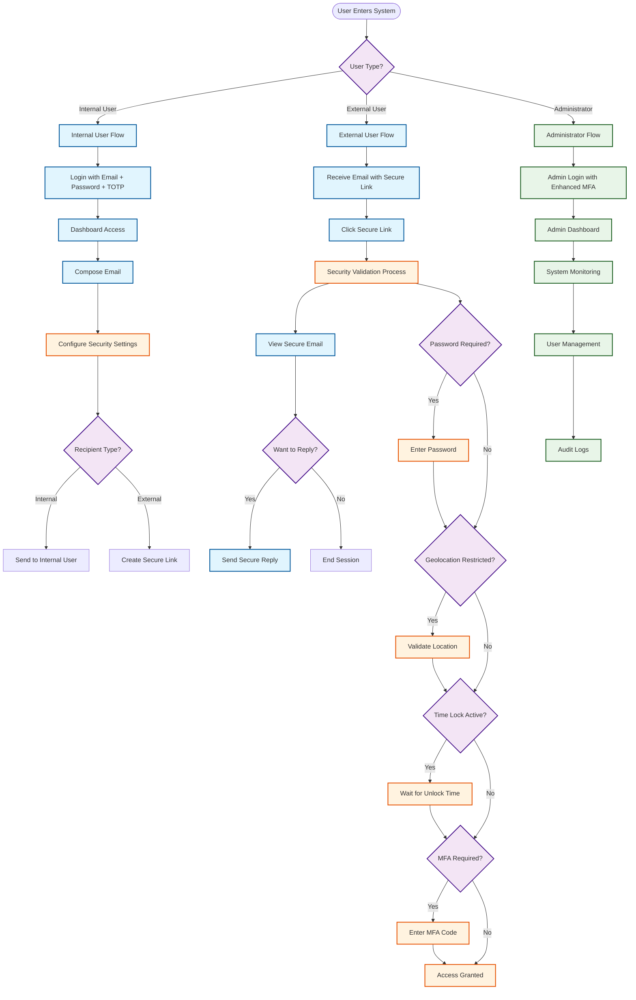
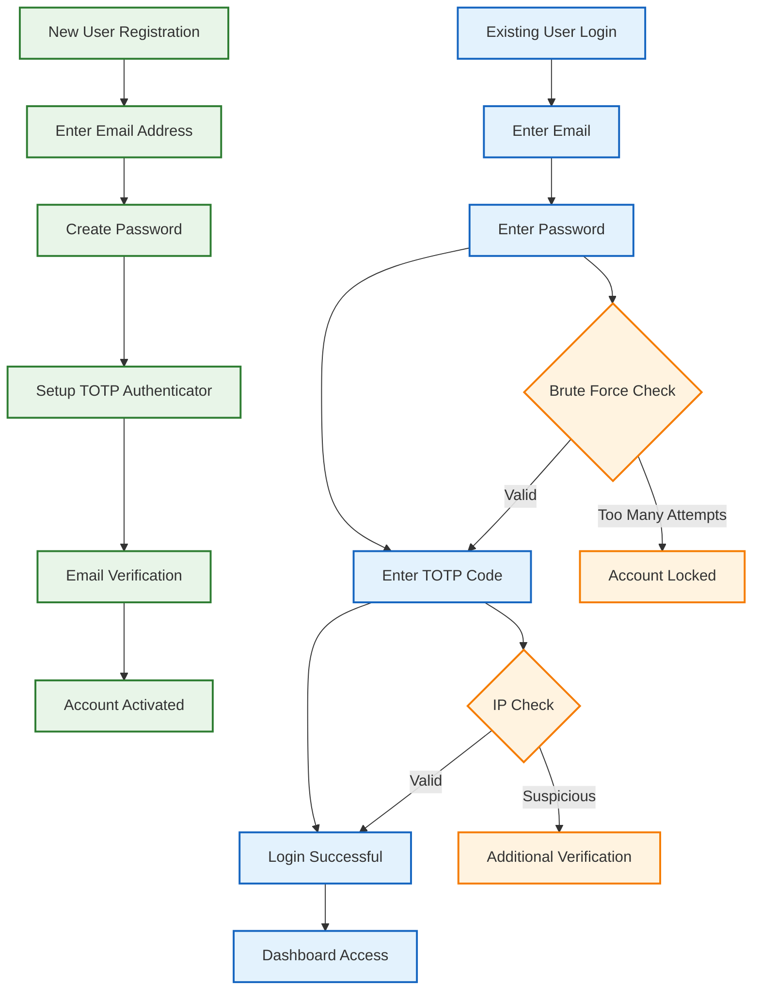
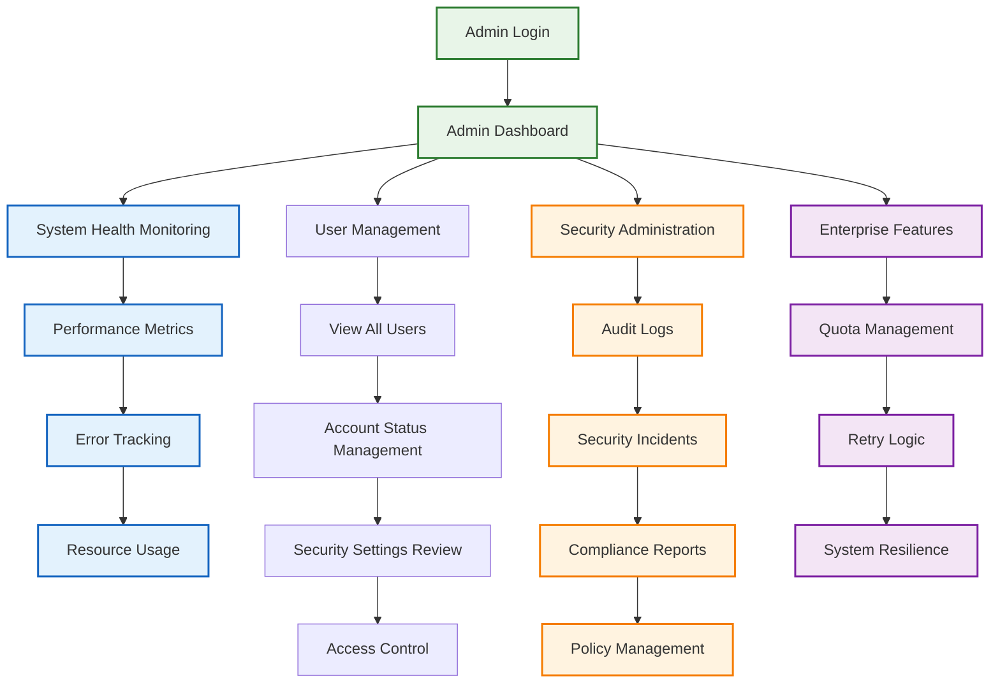
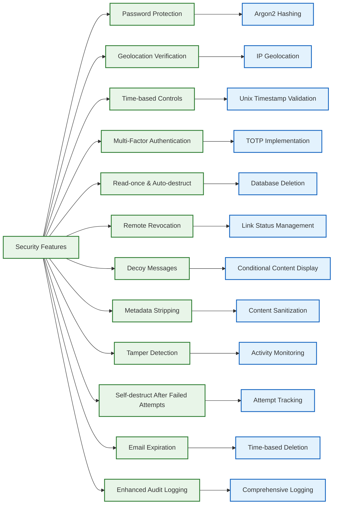
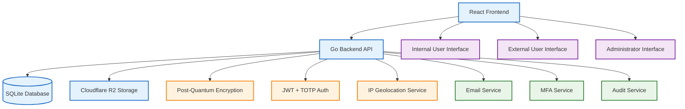

# 🗺️ **Visual User Flow Map: Secure Email System**

## 📊 **Complete System Flow Overview**



---

## 🔐 **Authentication Flow**



---

## 📧 **Internal User Email Flow**

```mermaid
graph LR
    %% Email Composition
    ComposeEmail[Compose Email] --> RecipientInput[Enter Recipients]
    RecipientInput --> SubjectInput[Enter Subject]
    SubjectInput --> MessageInput[Write Message]
    MessageInput --> AttachmentUpload[Upload Attachments]
    AttachmentUpload --> SecuritySettings[Configure Security]
    
    %% Security Configuration
    SecuritySettings --> PasswordProtection{Password Protection?}
    PasswordProtection -->|Yes| SetPassword[Set Password]
    PasswordProtection -->|No| GeoRestriction{Geolocation Restriction?}
    SetPassword --> GeoRestriction
    
    GeoRestriction -->|Yes| SetGeoLocation[Set Allowed Locations]
    GeoRestriction -->|No| TimeLock{Time Lock?}
    SetGeoLocation --> TimeLock
    
    TimeLock -->|Yes| SetTimeLock[Set Unlock Time]
    TimeLock -->|No| MFARequired{MFA Required?}
    SetTimeLock --> MFARequired
    
    MFARequired -->|Yes| SetMFA[Configure MFA Type]
    MFARequired -->|No| AdditionalSecurity[Additional Security Settings]
    SetMFA --> AdditionalSecurity
    
    %% Send Process
    AdditionalSecurity --> SendEmail[Send Email]
    SendEmail --> RecipientCheck{Recipient Type?}
    RecipientCheck -->|Internal| DirectSend[Direct Send]
    RecipientCheck -->|External| CreateSecureLink[Create Secure Link]
    
    CreateSecureLink --> SendNotification[Send Notification Email]
    SendNotification --> ExternalRecipient[External Recipient Receives]
    
    %% Styling
    classDef compositionFlow fill:#f3e5f5,stroke:#7b1fa2,stroke-width:2px
    classDef securityConfig fill:#fff3e0,stroke:#f57c00,stroke-width:2px
    classDef sendFlow fill:#e8f5e8,stroke:#2e7d32,stroke-width:2px
    
    class ComposeEmail,RecipientInput,SubjectInput,MessageInput,AttachmentUpload compositionFlow
    class SecuritySettings,PasswordProtection,SetPassword,GeoRestriction,SetGeoLocation,TimeLock,SetTimeLock,MFARequired,SetMFA,AdditionalSecurity securityConfig
    class SendEmail,RecipientCheck,DirectSend,CreateSecureLink,SendNotification,ExternalRecipient sendFlow
```



---

## 🌐 **External User Secure Link Flow**

```mermaid
graph TD
    %% Receive and Access
    ReceiveLink[Receive Secure Link Email] --> ClickSecureLink[Click Secure Link]
    ClickSecureLink --> SecurityValidation[Security Validation Process]
    
    %% Security Validation Chain
    SecurityValidation --> CheckExpiration{Link Expired?}
    CheckExpiration -->|Yes| LinkExpired[Link Expired - Access Denied]
    CheckExpiration -->|No| CheckRevoked{Link Revoked?}
    
    CheckRevoked -->|Yes| LinkRevoked[Link Revoked - Access Denied]
    CheckRevoked -->|No| CheckPassword{Password Required?}
    
    CheckPassword -->|Yes| PasswordPrompt[Enter Password]
    PasswordPrompt --> ValidatePassword{Password Correct?}
    ValidatePassword -->|No| PasswordFailed[Password Failed]
    PasswordFailed --> AttemptLimit{Attempt Limit Reached?}
    AttemptLimit -->|Yes| LinkDestroyed[Link Destroyed]
    AttemptLimit -->|No| PasswordPrompt
    ValidatePassword -->|Yes| CheckGeoLocation{Geolocation Restricted?}
    
    CheckPassword -->|No| CheckGeoLocation
    
    CheckGeoLocation -->|Yes| ValidateLocation{Location Valid?}
    ValidateLocation -->|No| LocationBlocked[Location Blocked]
    ValidateLocation -->|Yes| CheckTimeLock{Time Lock Active?}
    
    CheckGeoLocation -->|No| CheckTimeLock
    
    CheckTimeLock -->|Yes| CheckTime{Current Time Valid?}
    CheckTime -->|No| TimeBlocked[Time Lock Active - Wait Required]
    CheckTime -->|Yes| CheckMFA{MFA Required?}
    
    CheckTimeLock -->|No| CheckMFA
    
    CheckMFA -->|Yes| MFAPrompt[Enter MFA Code]
    MFAPrompt --> ValidateMFA{MFA Valid?}
    ValidateMFA -->|No| MFAFailed[MFA Failed]
    ValidateMFA -->|Yes| AccessGranted[Access Granted]
    
    CheckMFA -->|No| AccessGranted
    
    %% Email Viewing
    AccessGranted --> CreateSession[Create Viewing Session]
    CreateSession --> SanitizeContent[Sanitize Email Content]
    SanitizeContent --> DisplayEmail[Display Secure Email]
    DisplayEmail --> AttachmentAccess{Attachments?}
    AttachmentAccess -->|Yes| DownloadAttachment[Download Attachments]
    AttachmentAccess -->|No| ReplyOption{Want to Reply?}
    DownloadAttachment --> ReplyOption
    
    %% Reply Process
    ReplyOption -->|Yes| ComposeReply[Compose Secure Reply]
    ReplyOption -->|No| EndSession[End Session]
    ComposeReply --> SendReply[Send Secure Reply]
    SendReply --> NewSecureLink[Create New Secure Link]
    NewSecureLink --> NotifySender[Notify Original Sender]
    
    %% Styling
    classDef accessFlow fill:#e1f5fe,stroke:#0277bd,stroke-width:2px
    classDef securityCheck fill:#fff3e0,stroke:#f57c00,stroke-width:2px
    classDef viewingFlow fill:#e8f5e8,stroke:#2e7d32,stroke-width:2px
    classDef replyFlow fill:#f3e5f5,stroke:#7b1fa2,stroke-width:2px
    
    class ReceiveLink,ClickSecureLink,CreateSession,SanitizeContent,DisplayEmail,EndSession accessFlow
    class SecurityValidation,CheckExpiration,CheckRevoked,CheckPassword,PasswordPrompt,ValidatePassword,CheckGeoLocation,ValidateLocation,CheckTimeLock,CheckTime,CheckMFA,MFAPrompt,ValidateMFA,AccessGranted securityCheck
    class AttachmentAccess,DownloadAttachment viewingFlow
    class ReplyOption,ComposeReply,SendReply,NewSecureLink,NotifySender replyFlow
```



---

## ⚙️ **Administrative Flow**



---

## 🔒 **Security Features Flow Map**



---

## 📱 **User Journey Timeline**

```mermaid
gantt
    title Secure Email System User Journey Timeline
    dateFormat  YYYY-MM-DD
    section Internal User
    Registration           :done, reg, 2025-01-01, 1d
    First Login           :done, login, after reg, 1d
    Compose Email         :active, compose, after login, 2d
    Configure Security    :security, after compose, 1d
    Send Email           :send, after security, 1d
    
    section External User
    Receive Email        :receive, after send, 1d
    Click Secure Link    :click, after receive, 1d
    Security Validation  :validation, after click, 2d
    View Email          :view, after validation, 1d
    Reply (Optional)    :reply, after view, 1d
    
    section Administrator
    System Monitoring    :monitor, 2025-01-01, 7d
    User Management      :manage, 2025-01-02, 5d
    Security Review      :review, 2025-01-03, 3d
    Audit Logs          :audit, 2025-01-04, 4d
```

---

## 🎯 **Key Decision Points**

### **1. User Type Selection**
- **Internal User**: Full system access with all features
- **External User**: Secure link-based access only
- **Administrator**: System management and monitoring

### **2. Security Configuration (Optional)**
- **Password Protection**: Enable/disable with custom password
- **Geolocation Restrictions**: Country/city-level restrictions
- **Time-based Controls**: Expiration and time lock settings
- **Multi-Factor Authentication**: TOTP, SMS, or Email-based
- **Access Controls**: Read-once, auto-destruct, attempt limits

### **3. Recipient Type Detection**
- **Internal Recipients**: Direct email delivery
- **External Recipients**: Automatic secure link creation

### **4. Security Validation Chain**
- **Expiration Check**: Verify link hasn't expired
- **Revocation Check**: Verify link hasn't been revoked
- **Password Validation**: If password protection enabled
- **Geolocation Validation**: If location restrictions set
- **Time Lock Validation**: If time restrictions active
- **MFA Validation**: If multi-factor authentication required

### **5. Reply Decision**
- **Reply**: Create new secure link for ongoing conversation
- **No Reply**: End session and close secure link

---

## 📊 **Flow Statistics**

| Flow Type | Steps | Security Checks | User Types | Features |
|-----------|-------|-----------------|------------|----------|
| **Internal User** | 15+ | 3 | 1 | All 12 Security Features |
| **External User** | 20+ | 8 | 1 | Subject to Sender's Settings |
| **Administrator** | 12+ | 5 | 1 | System Management Tools |
| **Security Validation** | 8 | 8 | 2 | Real-time Enforcement |

---

## 🔄 **System Integration Points**



---

*This visual flow map provides a comprehensive overview of all user journeys through the Secure Email system, showing decision points, security validations, and system integrations.*
